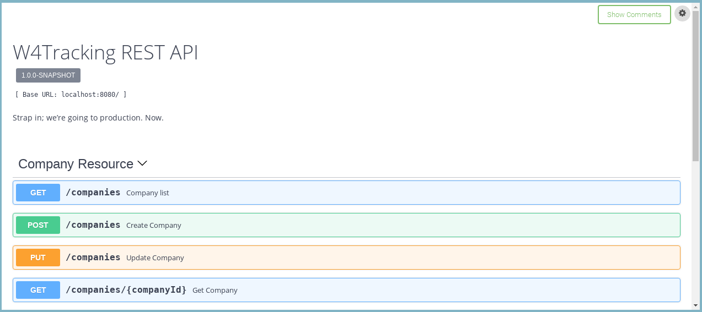

## W4tracking
### Opensource Tracking System (https://w4tracking.github.io) project.

## REST API Documentation
We use swagger and you can see documentation on:

https://app.swaggerhub.com/apis/w4tracking/w4tracking-rest-api/1.0.0-SNAPSHOT

