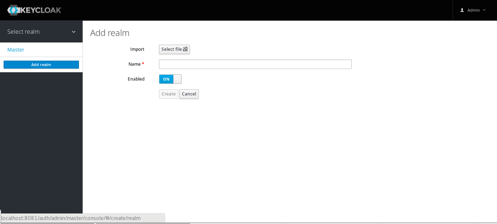

# W4tracking
### Opensource Tracking System (https://w4tracking.github.io) project.

[](https://travis-ci.org/w4tracking/w4tracking)
[](https://sonarcloud.io/dashboard/index/w4tracking)

## Quick Start

Requirements:
- Java 1.8 or eager
- Maven 3 or eager

Clone the repository:
```
git clone https://github.com/w4tracking/w4tracking.git
```

Inside project root folder execute:
```
mvn clean wildfly-swarm:run
```

Wait until the server starts, and then go to: <http://localhost:8080>

## Use Keycloak as Identity Provider

Requirements:
- Docker


Start a new Keycloak Server:
```
docker run -p 8081:8080 -e KEYCLOAK_USER=admin -e KEYCLOAK_PASSWORD=admin jboss/keycloak:3.4.3.Final
```

Wait until the server starts, and then go to: <http://localhost:8081>

Create a new Realm using **w4tracking-realm.json** file (located at project root).



Inside project root folder execute:
```
mvn clean wildfly-swarm:run -Dswarm.project.stage=keycloak
```

Wait until the server starts, and then go to: <http://localhost:8080>

# REST API Documentation
We use swagger and you can see documentation on:

https://app.swaggerhub.com/apis/w4tracking/w4tracking-rest-api/1.0.0-SNAPSHOT


